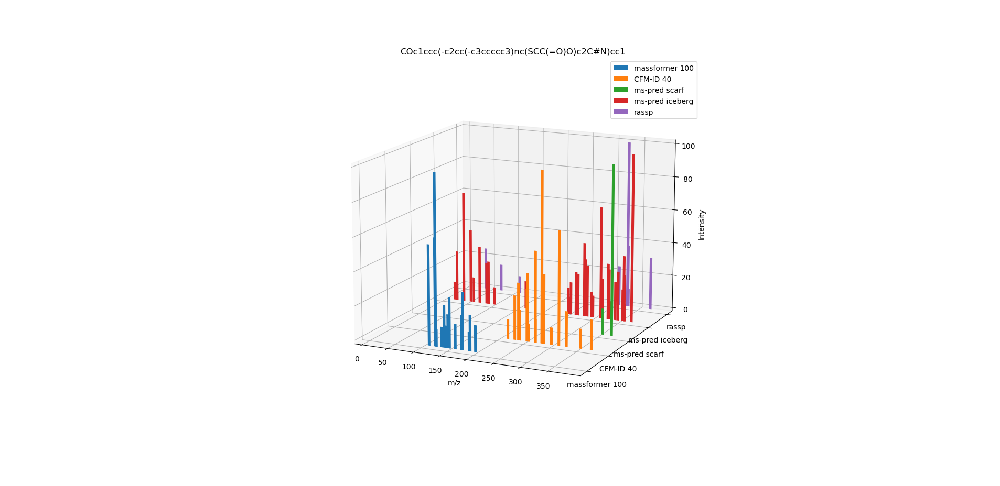

# MDU AI MS Project

There are different algorithms for MS/MS predicition but each one is installed, trained and run differently, accepting the input in a different way and producing the output in a different format which makes running different models and comparing the results difficult.

the MDU AI MS Project allows to easily run 5 different models to be run on a specific molecule in different energy level and compare the results.

## Description

The tool is a UI wrapper which runs 5 different trained mass spectra predcition models on a specific molecule,  at different energy levels, collects the resuts, filters, normalizes them and then compares them.

The UI allows entering a molecule in smiles format,  setting a threshold for the specta peaks and choosing which models to run and on whice energy level. 

After running the models, converting ,cleaning and normalizing the results they are presented in a table and a histogram for comparsion.


## Table of Contents

- [Installation](#installation)
- [Usage](#usage)
- [License](#license)

## Prerequisits

1) a Unix-like operating system (we tested on Linux with **Ubuntu 22.04**) 

2) The system must have **Anaconda** installed (could potentially run with **Python 3** without Anaconda but was not tested) 

3) The system must have **git** installed

4) The system must have **Docker** installed 


## Installation

### Download and install the algorithms 

 Download & install MassFormer:
    
    Clone the [MassFormer](https://github.com/Roestlab/massformer) repo from github
    
    ```bash
    git clone https://github.com/Roestlab/massformer
    ```

    Follow the [MassFormer installation instructions](https://github.com/Roestlab/massformer?tab=readme-ov-file#massformer) 


#### 2. Download & Install SCARF & ICEBERG
    Clone the [SCARF & ICEBERG](https://github.com/samgoldman97/ms-pred) repo from github
    
    ```bash
    git clone https://github.com/samgoldman97/ms-pred
    ```

    Follow the [SCARF & ICEBERG installation instructions](https://github.com/samgoldman97/ms-pred?tab=readme-ov-file#install--setup-) 
    

#### 3. Download & Install RASPP

    Clone the [SCARF & ICEBERG](https://github.com/samgoldman97/ms-pred) repo from github
    
    ```bash
     git clone https://github.com/samgoldman97/ms-pred
    ```

    follow [RASPP Installation instructions](https://github.com/thejonaslab/rassp-public?tab=readme-ov-file#option-1-local-installation) 


#### 4. Download CFM-ID 

    Download the CFM-ID Docker image:

    ```bash
    docker pull wishartlab/cfmid
    ```

### Download and install MDU AI MS Project

Install the dependencies
```bash
conda install numpy pandas matchms mathplotlib 
```

Download the current repository
```bash
git clone https://github.com/MDU-AI-MS-Project/MDU-AI-MS-Project
```

## Usage

How to run 

```bash
# Example usage
python run_all.py
```


*User Interface*


*Histogram*


*3D Histogram*


## License

[Specify the license under which your project is distributed.]

This project is licensed under the [License Name] License - see the [LICENSE](LICENSE) file for details.


